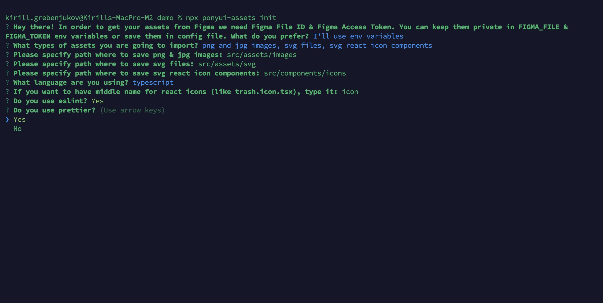

# PonyUI Assets Export

**PonyUI Assets Export** helps developers to export assets from Figma to local workspace!
FAST and FREE!

✨ Save your time - Configure what should be exported inside Figma with our Figma plugin and export all assets with a single command.

📤 Simplified asset export - No more repetitive steps for each file like save file to disk, rename and copy to source folder.

⚛️ Automated React icons - Generate React icon classes automatically, no more copy-pasting code to/from SVGR.

💻 Directly in your Local Workspace - our CLI tool will get all configured assets from your Figma file and save them in your source folder.


## Functionality

- You can export to png, jpg or svg files
- You can ask **PonyUI Assets Export** to export png and jpg assets with any scale ratio
- If you used SVGR to create **React icon components** from SVG files, **PonyUI Assets Export** will now do it for you.
- You can export any Figma node, doesn't matter what's inside. So you can compose different elements and export it as a single asset.
- Eslint and prettier supported for **React icon components**
- **PonyUI Assets Export** will remember exported nodes, so you always know if a particular node is already exported in your source code and where to find it.
- Inside the developer workspace you can configure different default folders for different types of assets.
- And you can specify a custom folder for any special asset if you need it.

## Usage

### Inside your Figma project

1. Open **PonyUI Assets Export Plugin** inside your Figma file.
2. Select a node you want to export in Figma and it appears in **PonyUI Assets Export** under the **Node** tab.
3. Under "Export as" combobox select any of png, jpg, svg or react-icon-component.
4. [Optional] It will fill **File Name** or **Class Name** text input automatically based on node's name, if you don't like the name, correct it.
5. [Optional] If you don't want it to be in a default path, please specify any relative path in your local workspace you want it to appear.
6. [Optional] For png & jpg assets if you want different scale than 2, set it.
7. Repeat steps 2-6 for each node you want to export.
8. Once done, open the "Publish" tab inside the Plugin and review changes you did.
9. Click "Save for Export" button and go to your local workspace.


### Setup in your local workspace

1. Get the CLI with

```
npm install --save-dev @ponyui/assets-export-cli
```

2. Run `ponyui-assets init` or just shortcut `pa init` command and answer the questions:

```
npx pa init
```



If you don't know how to get Figma File Id or Figma Access Token, please watch these two videos: https://youtu.be/g-i_erruGGc & https://youtu.be/O0fc89JVXII

### Import assets to your local workspace

```
npx pa import
```

## Monorepo

This monorepo contains several parts of PonyUI Assets Export tool

- ./figma-plugin - source code for PonyUI Assets Export Figma Plugin
- ./cli - source code for CLI tool
- ./demo - demo playground where you can try how it works

## What's PonyUI

[PonyUI](https://ponyui.com) is a toolchain aimed to automate the coding of your UI. It's going to be a small workhorse that converts Design to Code and
vice versa to make Design File is the real "source of thruth" for project's UI. Now we focus on the MVP tool to convert Figma to React & React Native.

BTW: UI for Figma Plugin in this repo was exported with PonyUI MVP 😉

We want to help software dev teams iterate faster and cheaper.

If it resonates with you, let's be in touch in our newsletter at [ponyui.com](https://ponyui.com) and follow our social media:

👉 [Twitter](https://twitter.com/pony_ui)  
👉 [YouTube](https://youtube.com/@ponyuirocks)  
👉 [LinkedIn](https://linkedin.com/in/kirill-grebeniukov/)
